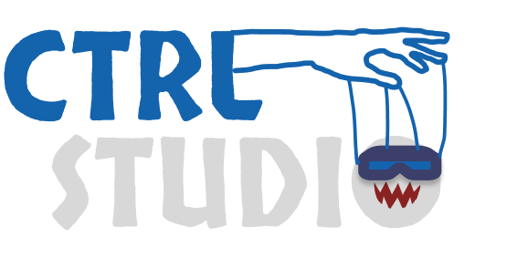

  

  <h1>Ctrl - Studio - The Shadow from Ringholt</h1>

### 🌐 [Visit demo on Netlify](https://ctrl-studio.netlify.app/)

## Project Overview

The Shadow from Ringholt is a single-player, story-driven game developed by CTRL-Studio.

This website serves as a platform to:

- Showcase the game and its trailer

- Share updates and progress

- Build a community through newsletter subscriptions

- Support CTRL-Studio in securing funding for development

_Note: Some assets are currently placeholders and will be updated as more become available._

## Carousel

For my carousel in Lore section i have chosen to use Embla Carousel: (https://www.embla-carousel.com/)
I chose Embla Carousel because it's lightweight, fast, and easy to integrate.

## Things to add later:

- CMS for The developers to Update info. Currently looking into Sanity.io and will implement this so the dev's can update the sections themselves.
- Norwegian and Sámi version of the website: also let the devs update data with different languages using sanity.io.
- Research and identify the most cost-effective and scalable third-party application for Support/Subscribe section.
- Policy Pricacy / Terms and conditions pages. (If i want the page to remain SPA then maybe a Modal window for these?)

###

<h3 align="left">Built with:</h3>

## Next.js, TailwindCSS, Motion, Embla-Carousel

###

### 📞 Contact

[My GitHub Profile](https://github.com/senbet22)

###

[Back to Top](#readme)

© 2025 CTRL-Studio. All rights reserved.  
This repository and its contents may not be copied, modified, or distributed without permission.
